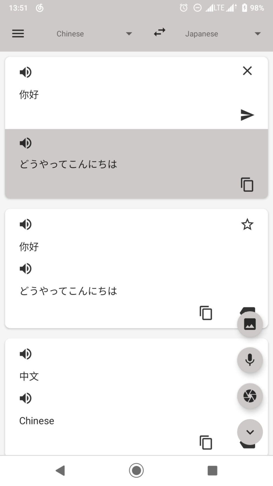
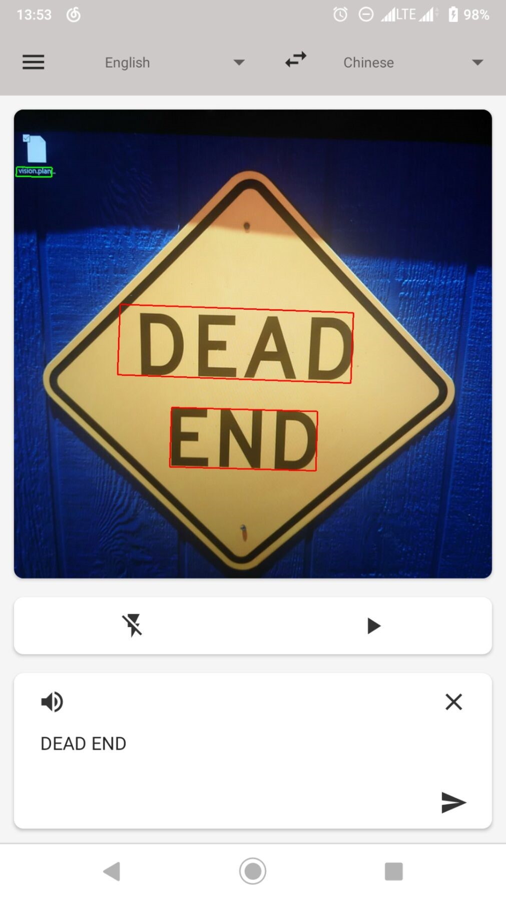

# 安卓视觉翻译APP  
    安卓视觉翻译APP，是一款视觉翻译软件，旨在将手机相机预览中的文本实时翻译为目标语言。
    APP借助Opencv、Firebase ML Kit构建。

## 文本翻译
      通过输入文本开始翻译。翻译会保存历史记录。顶部可以选择目标语言和源语言。
      

## 相机翻译
       将相机对准文字，保持相机缓慢移动便可翻译出识别的文字。点击下方的小箭头可以返回到文本翻译页面。
       点击预览将进入图片翻译模式，相机预览会暂停。

## 照片翻译
       选中选择的文本框便可，选择需要翻译的文本。

## 段落的判别  

自然场景下文本识别一个关键问题是如何定位文字、定位段落和句子。
这些问题可以考虑的很复杂，在本APP中，以一行连续的字符作为一行句子。
不对行进行逻辑上的语句、段落的划分。而是流出用户接口重新选择语句的顺序。

## 离线翻译

普通的在线翻译只能适用于，文本翻译和图片翻译。相机流翻译由于识别的误差、相机镜头的角度会导致
检测识别到的文本发生顺序、字符的改变。且相机预览间隔实践普遍低于30ms，而大多数http请求至少花费200ms。
这样的延迟对即时翻译是难以接受，因此使用了翻译缓存、离线翻译的技术来尽量减少平均翻译请求延迟。

## 文本检测和追踪

项目源代码包含了一个完整的文本检测和追踪的模块，然而由于编程能力限制，无法使用GPU加速计算。追踪检测时间开销接近500ms。
这里采用了高度集成化的Firebase ML Kit Vision API。但仅能识别出ascii字符的语言。
